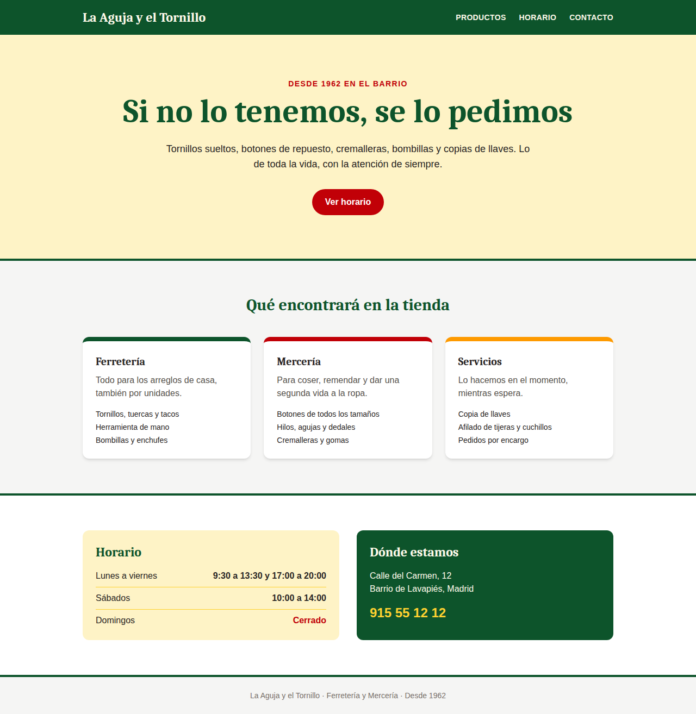

# Ejercicio: Vísteme con Tailwind

**La Aguja y el Tornillo · Ferretería y Mercería, desde 1962 en el barrio**

Os damos la web de una tienda de barrio de toda la vida, con todo el contenido escrito pero **sin ningún estilo**. Vuestro trabajo es "vestirla" usando **solo clases de Tailwind CSS** hasta que se parezca lo máximo posible al diseño objetivo.



---

## Archivos

| Archivo | Qué es |
| --- | --- |
| `index.html` | La página que tenéis que maquetar. Tailwind ya está enlazado. |
| `objetivo-escritorio.png` | Cómo debe verse en un ordenador. |
| `objetivo-movil.png` | Cómo debe verse en un móvil. |

---

## Reglas

1. **No se toca la estructura del HTML.** Solo se rellenan los atributos `class=""` que ya están puestos.
2. **No se escribe CSS propio.** Ni archivo `.css`, ni `style=""`. Todo con clases de Tailwind.
3. **Bloque a bloque.** Seguid el orden (1 a 5) y comprobad el resultado en el navegador después de cada cambio.
4. **Revisad también el móvil.** En el navegador: `F12` y el icono de dispositivo móvil (o `Ctrl + Shift + M`).

---

## Antes de empezar

- Abrid `index.html` en el navegador. Si lo veis como texto plano, sin márgenes ni tamaños, **está bien**: Tailwind resetea los estilos del navegador (*preflight*) y el diseño lo ponéis vosotros.
- Os recomendamos abrirlo con la extensión **Live Server** de VS Code para que se recargue solo al guardar.
- Instalad la extensión **Tailwind CSS IntelliSense** en VS Code: autocompleta las clases y, al pasar el ratón por encima, enseña el CSS que genera cada una.
- Tailwind está cargado desde el **Play CDN**, sin npm ni instalación:

```html
<script src="https://cdn.jsdelivr.net/npm/@tailwindcss/browser@4"></script>
```

---

## Cómo se lee una clase de Tailwind

Casi todas siguen el patrón **propiedad - valor**:

| Clase | Significa | CSS que genera |
| --- | --- | --- |
| `px-6` | relleno horizontal, tamaño 6 | `padding-inline: 1.5rem` |
| `text-4xl` | tamaño de letra 4xl | `font-size: 2.25rem` |
| `bg-green-900` | fondo verde, tono 900 (muy oscuro) | `background-color: ...` |
| `rounded-full` | esquinas totalmente redondeadas | `border-radius: ...` |

Y se les puede poner un **prefijo** delante:

| Prefijo | Cuándo se aplica | Ejemplo |
| --- | --- | --- |
| `md:` | a partir de 768px de ancho (tablet y escritorio) | `md:flex-row` |
| `hover:` | al pasar el ratón | `hover:bg-red-800` |
| `dark:` | si el sistema está en modo oscuro | `dark:bg-stone-900` |

Importante: Tailwind es **mobile first**. Las clases sin prefijo son para móvil, y con `md:` cambiáis lo que haga falta en pantallas grandes.

---

## Paleta del diseño objetivo

Todos son colores de la paleta de Tailwind ([ver todos los colores](https://tailwindcss.com/docs/colors)):

| Uso | Color |
| --- | --- |
| Verde rótulo (cabecera, títulos, caja de contacto) | `green-900` |
| Crema (portada, caja de horario) | `amber-100` |
| Mostaza (teléfono, hover de enlaces) | `amber-300` |
| Rojo (botón, "Desde 1962", "Cerrado") | `red-700` |
| Franja de la tercera tarjeta | `amber-500` |
| Fondo general | `stone-100` |
| Textos secundarios | `stone-500`, `stone-600` |
| Tarjetas | `white` |

La tipografía de los títulos es `font-serif`.

---

## Paso a paso

Dentro de `index.html` cada bloque tiene un comentario con lo que hay que conseguir y algunas pistas. Aquí tenéis los enlaces a la documentación de cada uno.

### 1. Cabecera

Fondo verde con texto crema. Contenido centrado con un ancho máximo. En móvil, logo y enlaces uno debajo del otro; en escritorio, logo a la izquierda y enlaces a la derecha. Enlaces en mayúsculas que cambian de color con el ratón.

- [Background color](https://tailwindcss.com/docs/background-color) · [Color](https://tailwindcss.com/docs/color)
- [Max width](https://tailwindcsgrid grid-cols-3 grid-rows-3 gap-4s.com/docs/max-width) · [Margin](https://tailwindcss.com/docs/margin) (para centrar: `mx-auto`) · [Padding](https://tailwindcss.com/docs/padding)
- [Display](https://tailwindcss.com/docs/display) · [Flex direction](https://tailwindcss.com/docs/flex-direction) · [Justify content](https://tailwindcss.com/docs/justify-content) · [Align items](https://tailwindcss.com/docs/align-items) · [Gap](https://tailwindcss.com/docs/gap)
- [Text transform](https://tailwindcss.com/docs/text-transform) · [Letter spacing](https://tailwindcss.com/docs/letter-spacing) · [Font family](https://tailwindcss.com/docs/font-family)

### 2. Portada

Fondo crema con una línea verde gruesa abajo. Todo centrado y con mucho aire. Título grande en serif, más grande en escritorio. Botón rojo en forma de píldora que se oscurece con el ratón.

- [Text align](https://tailwindcss.com/docs/text-align) · [Font size](https://tailwindcss.com/docs/font-size) · [Font weight](https://tailwindcss.com/docs/font-weight)
- [Border width](https://tailwindcss.com/docs/border-width) · [Border color](https://tailwindcss.com/docs/border-color) · [Border radius](https://tailwindcss.com/docs/border-radius)
- [Hover, focus y otros estados](https://tailwindcss.com/docs/hover-focus-and-other-states)
- [Diseño responsive (prefijo md:)](https://tailwindcss.com/docs/responsive-design)

### 3. Productos (tarjetas)

Una columna en móvil y tres en escritorio. Tarjetas blancas con esquinas redondeadas, sombra y una franja gruesa de color arriba. Al pasar el ratón suben un poco con una transición suave.

- [Grid template columns](https://tailwindcss.com/docs/grid-template-columns) · [Gap](https://tailwindcss.com/docs/gap)
- [Box shadow](https://tailwindcss.com/docs/box-shadow) · [Border width](https://tailwindcss.com/docs/border-width)
- [Translate](https://tailwindcss.com/docs/translate) · [Transition property](https://tailwindcss.com/docs/transition-property)
- Espacio entre los elementos de la lista: `space-y-*`, en la página de [Margin](https://tailwindcss.com/docs/margin)

### 4. Horario y contacto

Dos cajas, una encima de otra en móvil y una al lado de la otra en escritorio, con el mismo ancho. En cada fila del horario, el día a la izquierda y la hora a la derecha, con una línea fina debajo.

- [Flex](https://tailwindcss.com/docs/flex) (para que las dos cajas midan lo mismo: `flex-1`)
- [Flex direction](https://tailwindcss.com/docs/flex-direction) · [Justify content](https://tailwindcss.com/docs/justify-content)
- [Border width](https://tailwindcss.com/docs/border-width) (`border-b`, `border-y-4`)

### 5. Pie

Texto pequeño, gris y centrado, con espacio arriba y abajo.

- [Font size](https://tailwindcss.com/docs/font-size) · [Color](https://tailwindcss.com/docs/color) · [Padding](https://tailwindcss.com/docs/padding)

---

## Retos extra

Si terminéis antes, probad alguno de estos:

1. **Modo oscuro.** Usad el prefijo `dark:` para que la página se vea bien cuando el sistema está en modo oscuro. [Dark mode](https://tailwindcss.com/docs/dark-mode)
2. **Color propio.** Cread un color `rotulo` con `@theme` dentro de una etiqueta `<style type="text/tailwindcss">` y usadlo como `bg-rotulo` o `text-rotulo`. [Theme variables](https://tailwindcss.com/docs/theme)
3. **Menú hamburguesa.** En móvil, ocultad los enlaces tras un botón y mostradlos con un poco de JavaScript nativo (poniendo y quitando una clase como `hidden`).

---

## Documentación de referencia

- [Documentación oficial de Tailwind CSS](https://tailwindcss.com/docs): usad el buscador (`Ctrl + K`) y escribid la propiedad CSS que queréis conseguir (por ejemplo "padding" o "justify").
- [Estilar con clases de utilidad](https://tailwindcss.com/docs/styling-with-utility-classes): la idea general de cómo funciona Tailwind.
- [Play CDN](https://tailwindcss.com/docs/installation/play-cdn): cómo se carga Tailwind sin instalar nada.
- [Hover, focus y otros estados](https://tailwindcss.com/docs/hover-focus-and-other-states)
- [Diseño responsive](https://tailwindcss.com/docs/responsive-design)
- [Paleta de colores](https://tailwindcss.com/docs/colors)

**Truco:** si sabéis qué propiedad de CSS queréis (por ejemplo `justify-content: space-between`), buscad esa propiedad en la documentación y os dirá qué clase de Tailwind la genera (`justify-between`).
